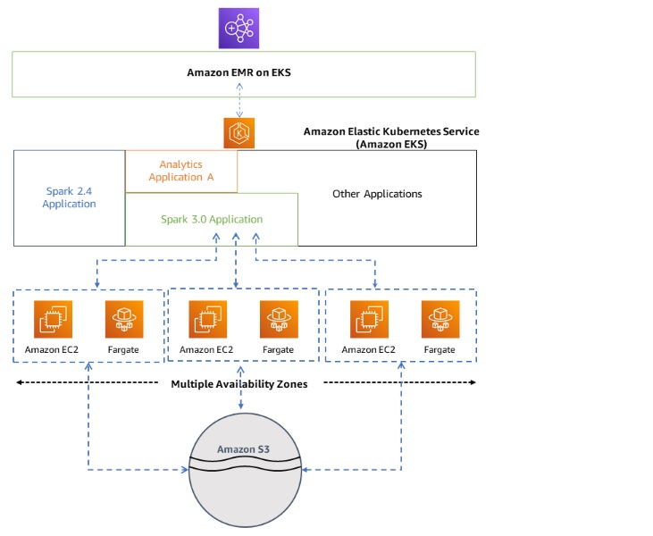
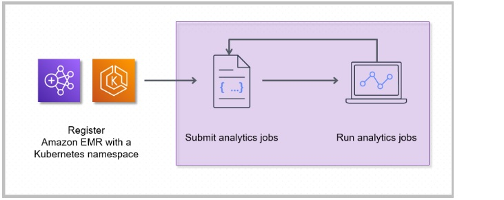
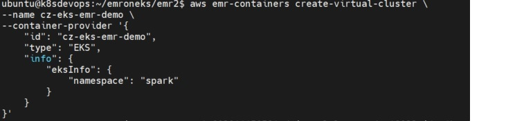
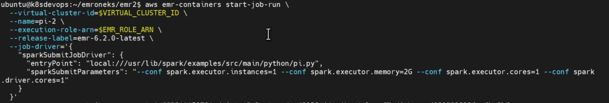
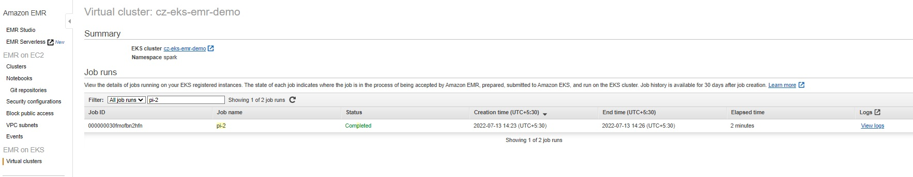
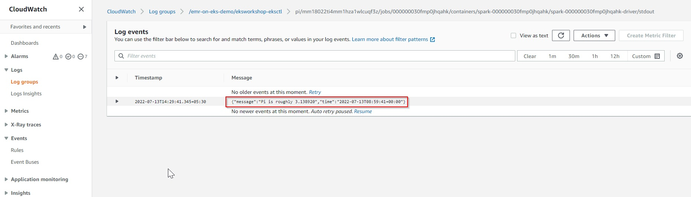
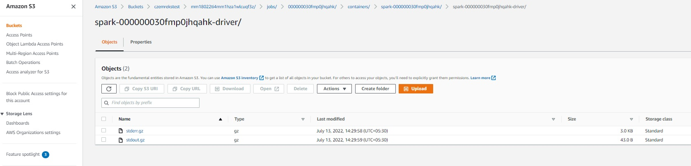
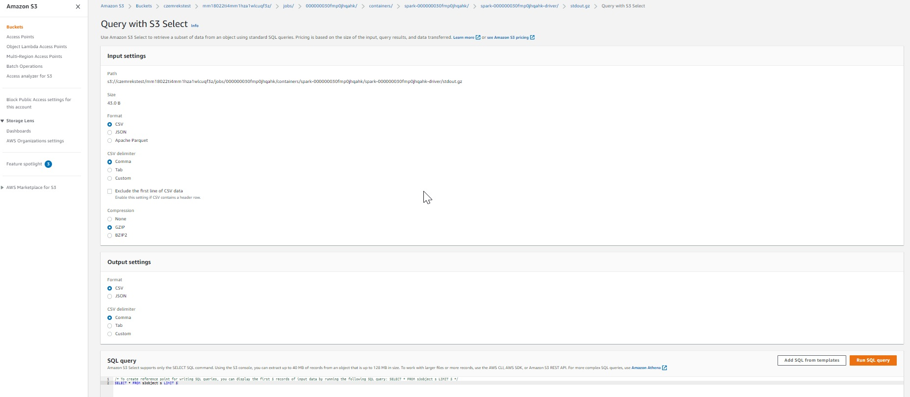
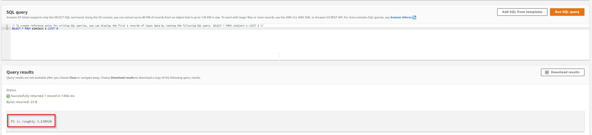

# Deploying Amazon EMR (Elastic Map Reduce) on Amazon EKS using Terraform

Amazon EMR on EKS provides a deployment option for Amazon EMR that allows you to run open-source big data frameworks on Amazon Elastic Kubernetes Service (Amazon EKS). With this deployment option, you can focus on running analytics workloads while Amazon EMR on EKS builds, configures, and manages containers for open-source applications.

## Architecture
Amazon EMR on EKS loosely couples applications to the infrastructure that they run on. Each infrastructure layer provides orchestration for the subsequent layer. When you submit a job to Amazon EMR, your job definition contains all of its application-specific parameters. Amazon EMR uses these parameters to instruct Amazon EKS about which pods and containers to deploy. Amazon EKS then brings online the computing resources from Amazon EC2 and AWS Fargate required to run the job.  

With this loose coupling of services, you can run multiple, securely isolated jobs simultaneously. You can also benchmark the same job with different compute backends or spread your job across multiple Availability Zones to improve availability.  

Diagram illustrates how Amazon EMR on EKS works with other AWS services.

## Kubernetes namespace
Amazon EKS uses Kubernetes namespaces to divide cluster resources between multiple users and applications. These namespaces are the foundation for multi-tenant environments. A Kubernetes namespace can have either Amazon EC2 or AWS Fargate as the compute provider. This flexibility provides you with different performance and cost options for your jobs to run on.

## Virtual cluster
A virtual cluster is a Kubernetes namespace that Amazon EMR is registered with. Amazon EMR uses virtual clusters to run jobs and host endpoints. Multiple virtual clusters can be backed by the same physical cluster. However, each virtual cluster maps to one namespace on an EKS cluster.  
Virtual clusters do not create any active resources that contribute to your bill or that require lifecycle management outside the service.

## Job run
A job run is a unit of work, such as a Spark jar, PySpark script, or SparkSQL query, that you submit to Amazon EMR on EKS. One job can have multiple job runs. When you submit a job run, you include the following information:  

* A virtual cluster where the job should run.  

* A job name to identify the job.  

* The execution role a scoped IAM role that runs the job and allows you to specify which resources can be accessed by the job.  

* The Amazon EMR release label that specifies the version of open-source applications to use.  

* The artifacts to use when submitting your job, such as spark-submit parameters.  

By default, logs are uploaded to the Spark History server and are accessible from the AWS Management Console. You can also push event logs, execution logs, and metrics to Amazon S3 and Amazon CloudWatch.

## Amazon EMR containers
Amazon EMR containers is the API name for Amazon EMR on EKS. The emr-containers prefix is used in the following scenarios:  

* It is the prefix in the CLI commands for Amazon EMR on EKS. For example, aws emr-containers start-job-run.  

* It is the prefix before IAM policy actions for Amazon EMR on EKS. For example, "Action": [ "emr-containers:StartJobRun"]. For more information, see Policy actions for Amazon EMR on EKS.  

 * It is the prefix used in Amazon EMR on EKS service endpoints. For example, emr-containers.us-east-1.amazonaws.com.   
 
 
 ## How the components work together  
The following steps and diagram illustrate the Amazon EMR on EKS workflow:  

* Use an existing Amazon EKS cluster or create one by using the eksctl command line utility or Amazon EKS console.  

* Create a virtual cluster by registering Amazon EMR with a namespace on an EKS cluster.  

* Submit your job to the virtual cluster using the AWS CLI or SDK.  
  

Registering Amazon EMR with a Kubernetes namespace on Amazon EKS creates a virtual cluster. Amazon EMR can then run analytics workloads on that namespace. When you use Amazon EMR on EKS to submit Spark jobs to the virtual cluster, Amazon EMR on EKS requests the Kubernetes scheduler on Amazon EKS to schedule pods.

For each job that you run, Amazon EMR on EKS creates a container with an Amazon Linux 2 base image, Apache Spark, and associated dependencies. Each job runs in a pod that downloads the container and starts to run it. The pod terminates after the job terminates. If the containers image has been previously deployed to the node, then a cached image is used and the download is bypassed. Sidecar containers, such as log or metric forwarders, can be deployed to the pod. After the job terminates, you can still debug it using Spark application UI in the Amazon EMR console.  

## Setting up  
Complete the following tasks to get set up for Amazon EMR on EKS.  Refer [setup-emr-on-eks](https://docs.aws.amazon.com/emr/latest/EMR-on-EKS-DevelopmentGuide/setting-up.html)

1. Install the AWS CLI [awscli](https://docs.aws.amazon.com/emr/latest/EMR-on-EKS-DevelopmentGuide/setting-up-cli.html)

2. Install eksctl [eksctl](https://docs.aws.amazon.com/emr/latest/EMR-on-EKS-DevelopmentGuide/setting-up-eksctl.html)

3. Set up an Amazon EKS cluster [eks cluster](https://docs.aws.amazon.com/emr/latest/EMR-on-EKS-DevelopmentGuide/setting-up-eks-cluster.html)  
   - To deploy EMR on EKS cluster using Terraform, download code to a workspace.  
     git clone https://prasannavenkataswamy@bitbucket.org/cloudzenix/emr-on-eks.git  
     cd emr-on-eks/terraform    
    - Create an EKS Cluster  
      Run terraform:  
      terraform init  
      terraform apply  
     
    - Update kubeconfig  
      Update and download kubernetes config file to local. You can see the bash command like below after terraform apply is complete. These are utility scripts and commands for managing EMR and EKS clusters. It looks like below.  

      Outputs:  

      create_emr_containers = "bash -e ./create-emr-virtual-cluster.sh"  
      delete_emr_containers = "bash -e ./delete-emr-virtual-cluster.sh"  
      enable_emr_access = "eksctl create iamidentitymapping --cluster eks-emr --service-name emr-containers --namespace default"  
      kubeconfig = "bash -e .terraform/modules/eks/script/update-kubeconfig.sh -r ap-northeast-2 -n eks-emr -k kubeconfig"  
      Copy and run it to save the kubernetes configuration file to your local workspace. And export it as an environment variable to apply to the terminal.  

      bash -e .terraform/modules/eks/script/update-kubeconfig.sh -r us-east-1 -n cz-eks-emr-demo -k kubeconfig  
      export KUBECONFIG=kubeconfig  

4. Enable cluster access for Amazon EMR on EKS [cluster access](https://docs.aws.amazon.com/emr/latest/EMR-on-EKS-DevelopmentGuide/setting-up-cluster-access.html)  

5. Enable IAM Roles for Service Accounts (IRSA) on the EKS cluster [enable iam roles](https://docs.aws.amazon.com/emr/latest/EMR-on-EKS-DevelopmentGuide/setting-up-enable-IAM.html)  

6. Create a job execution role [execution role](https://docs.aws.amazon.com/emr/latest/EMR-on-EKS-DevelopmentGuide/creating-job-execution-role.html)  

7. Update the trust policy of the job execution role [update policy](https://docs.aws.amazon.com/emr/latest/EMR-on-EKS-DevelopmentGuide/setting-up-trust-policy.html)  

8. Grant users access to Amazon EMR on EKS [grant access](https://docs.aws.amazon.com/emr/latest/EMR-on-EKS-DevelopmentGuide/setting-up-iam.html)  

9. Register the Amazon EKS cluster with Amazon EMR [register eks emr](https://docs.aws.amazon.com/emr/latest/EMR-on-EKS-DevelopmentGuide/setting-up-registration.html)  
   
       Use the command (as in below image) to create a virtual cluster with a name of your choice for the Amazon EKS cluster and namespace that you set up in previous steps.  
        

## Submit jobs to EMR on EKS
Run a Spark Pi Python code on EMR 6.2.0. Substitute the values for virtual-cluster-id and execution-role-arn.  

virtual-cluster-id: Copy the cluster id from the output of below command.  
$aws emr-containers list-virtual-clusters  
Or
$export VIRTUAL_CLUSTER_ID=$(aws emr-containers list-virtual-clusters --query "virtualClusters[?state=='RUNNING'].id" --output text)export EMR_ROLE_ARN=$(aws iam get-role --role-name EMRContainers-JobExecutionRole --query Role.Arn --output text)  
$export EMR_ROLE_ARN=$(aws iam get-role --role-name EMRContainers-JobExecutionRole --query Role.Arn --output text)

## Submit the job by running the command as below  
  

### sample output of job submit  
arn: arn:aws:emr-containers:us-east-1:123498374500/virtualclusters/mm18022ti4mm1hza1wlcuqf3z  
id: 000000030fmofbn2hfn  
name: cz-eks-emr-demo  

Check the completed job in EMR console. It should look as below.  
  

## MONITORING AND LOGGING

## send logs to s3 and cloudwatch.  
Logs from the EMR jobs can be sent to cloudwatch and s3. In the last section of running sample job, we did not configure logging.    
Run the job again and send the logs to s3 and cloudwatch.    

#### Create a cloudwatch log group and an S3 bucket before we can start sending the logs.    

aws logs create-log-group --log-group-name=/emr-on-eks-demo/eksworkshop-eksctl  

export s3DemoBucket=s3://czemrekstest  
aws s3 mb $s3DemoBucket  

#### Make sure that we have the variables set for the S3 bucket, virtual EMR clusters id, and the ARN of the role that EMR uses for job execution.  

export s3DemoBucket=s3://czemrekstest  
export VIRTUAL_CLUSTER_ID=$(aws emr-containers list-virtual-clusters --query "virtualClusters[?state=='RUNNING'].id" --output text)  
export EMR_ROLE_ARN=$(aws iam get-role --role-name EMRContainers-JobExecutionRole --query Role.Arn --output text)  

#### Run the job again with logging enabled.
Make sure the available path for request.json file -  

#### Trigger the Spark job  
$aws emr-containers start-job-run --cli-input-json file://emr-on-eks/terraform/request.json  

Output:  
arn: arn:aws:emr-containers:us-east-1:123456788500:/virtualclusters/91ahntqda03wu22mjfo9dkus1/jobruns/000000030fe86gecta8  
id: 000000030fmp0jhqahk  
name: pi-4  
virtualClusterId: mm18022ti4mm1hza1wlcuqf3z  

## How to check logs on CloudWatch and S3
Post triggering the job and getting the output as shown above, next move on to CloudWatch console to see the logs.  
open the log group /emr-on-eks-demo/eksworkshop-eksctl and filter stream by driver/stdout:    
click on the log stream and you will be able to see the output of the job.    

  

#### We can also go to the s3 bucket configured for logging and see the logs.  
  
Download the stdout.gz file and extract it.  
You should be able to find its contents similar as below:  

Pi is roughly 3.138760  

#### Otherway to check the job output from S3 logs, query the logs with S3 Select.   

  

#### Post running the Query, see the output as below.    
  

## Clean up
When you’re done using this solution, you should delete the EMR virtual-server and the EKS Cluster launched by Terraform.

TO delete the EMR virtual-server  
$ aws emr-containers delete-virtual-cluster --id 000000030fmofbn2hfn  

To delete EKS Cluster 
cd to the terraform workspace  
$...emr-on-eks/terraform/  
$terraform destroy  

## Conclusion  
The post described how we can run a existing Apache Spark workload on Amazon EMR on EKS. The use case demonstrated setting up the infrastructure, and running and monitoring the Spark job.  
Also seen how to push job logs to CloudWatch and S3 to see the output of the jobs.  

